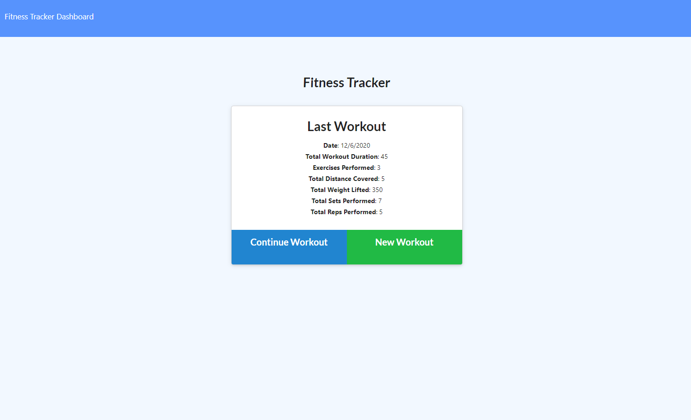
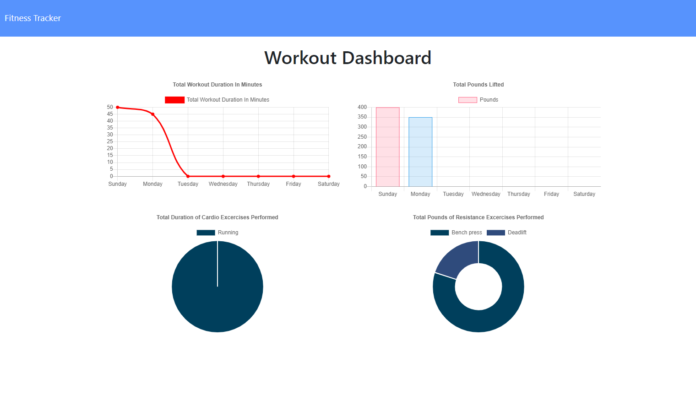

# Bootcamp - Homework 12: Workout Tracker

:link: [Go to the Workout Tracker](https://boiling-lake-12312.herokuapp.com/)

A website for keeping track of your daily workouts. Review a summary of your last workout, add exercises to your current workout and view stats for the week!

Exercises include two types: cardio and resistance. Cardio exercises track the distance covered in miles while resistance exercises track sets, reps and weight lifted in pounds.

Acceptance criteria, a user story, front-end starter code and a seed file were given for this assignment.

## Purpose

Reach your fitness goals faster by logging your workout progress!

## Local Installation

1. Run `npm install` before using the application locally.
2. For dummy data, run the [`seed.js`](./seeders/seed.js) file.
3. Workout!

## Built with

### Back-End

- [Node.js](https://nodejs.org/en/)
- [Mongoose](https://mongoosejs.com/)
- [Express](https://expressjs.com/)

### Front-end

- [Semantic UI](https://semantic-ui.com/)

## License

This project is licensed under the **MIT License**.

This homework assignment is part of the [Carleton University Coding Bootcamp](https://bootcamp.carleton.ca/).
